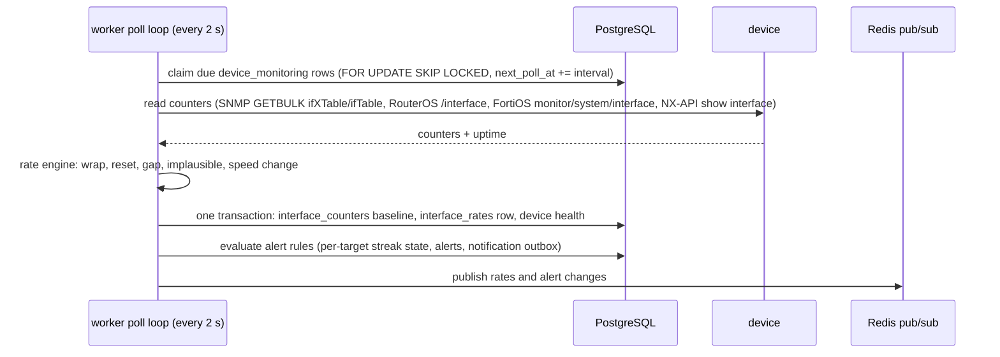

# NexoraDC: architecture

Status: Phase 1 (Foundation) implemented. Later phases are designed here so the foundation does not need rework, but they are **not built yet**. See [feature-matrix.md](feature-matrix.md) for what works today.

## Goals that shape the design

1. **One source of truth** for physical, network, power and service inventory, with every change audited.
2. **Telemetry keeps flowing with nobody watching.** Polling runs in background workers, never in the browser or the API request path.
3. **Measured and estimated data are never confused.** Every bandwidth or power value carries its source, quality and sample time.
4. **Monitoring is separate from control.** Read-only collectors cannot change devices. Privileged operations (power, network configuration, provisioning) go through a separate, permissioned and audited path.
5. **Native Ubuntu deployment.** Every component runs under systemd on an Ubuntu LTS host. Docker is optional and used only for development services.

## Components

```mermaid
flowchart LR
  subgraph Browser
    SPA[React SPA<br/>Vite build]
  end
  subgraph Host["Ubuntu LTS host (systemd)"]
    NGINX[nginx<br/>TLS, static SPA, /api proxy]
    API[cdcim-api<br/>NestJS REST + SSE]
    WRK[cdcim-worker<br/>discovery queue (BullMQ), schedules, DNS,<br/>polling, rollups, alerts, notifications]
  end
  PG[(PostgreSQL<br/>inventory + telemetry)]
  RD[(Redis 7<br/>queues, locks, pub/sub)]
  S3[(S3-compatible storage<br/>attachments, reports, backups)]
  DEV[[Network devices, BMCs,<br/>Proxmox, Virtualizor, WHMCS]]

  SPA -- HTTPS same origin --> NGINX --> API
  API --> PG
  API --> RD
  WRK --> PG
  WRK --> RD
  WRK -- SNMP / Redfish / APIs<br/>management network only --> DEV
  API -. webhooks in .-> DEV
  API --> S3
```

| Process | Responsibility | Phase |
|---|---|---|
| `cdcim-api` | REST API (`/api/v1`), auth, RBAC, validation, OpenAPI, SSE fan-out of live updates | 1 |
| `cdcim-worker` | The only process that decrypts credentials and talks to devices. Phase 3: read-only discovery runs (BullMQ), discovery schedules, DNS publishing. Phase 4: interface polling (claimed from PostgreSQL), rollups and retention, alert evaluation, notification delivery. Later: power collection, provisioning steps, webhook delivery | 3–4 |
| nginx | TLS termination, serves the built SPA, proxies `/api` to the API on 127.0.0.1 | 1 (config), 9 (validated) |

The API and the SPA share one origin, so session cookies stay first-party and CORS is not needed in production.

## Repository layout

```
crapplet-dcim/
├── apps/
│   ├── api/                 NestJS API
│   │   ├── src/
│   │   │   ├── auth/        sessions, passwords, MFA, guards, decorators
│   │   │   ├── audit/       hash-chained audit log
│   │   │   ├── tenancy/     tenant row filters
│   │   │   ├── customers/ users/ roles/ settings/ overview/ health/
│   │   │   ├── common/      logging, errors, validation, SecretBox encryption
│   │   │   ├── db/          Drizzle schema + pool
│   │   │   └── cli/         migrate, create-admin, seed
│   │   ├── drizzle/         SQL migrations (checked in, applied in order)
│   │   └── test/            end-to-end tests against real Postgres + Redis
│   └── web/                 React + Vite + Tailwind SPA
├── packages/
│   └── shared/              permission catalog, roles, navigation, Zod schemas, unit formatting
├── deploy/                  env example, systemd units, nginx, docker-compose (dev only)
└── docs/                    this documentation
```

`@crapplet/shared` is imported by both the API and the SPA, so validation rules, permission names and the list of navigation sections cannot drift apart.

## Request path

1. nginx terminates TLS and forwards `/api/*` to `127.0.0.1:4000`.
2. Helmet sets security headers; `pino-http` assigns or accepts an `X-Request-Id`.
3. Global guards run in order: **rate limit → authenticate (session + CSRF + MFA gate) → authorize (permissions, staff-only)**.
4. Controllers validate input with the shared Zod schemas (`ZodPipe`) and call services.
5. Services add a **tenant filter** to every query and write the change and its audit record **in the same transaction**.
6. `AllExceptionsFilter` returns `{ error, message, requestId, issues? }` and never leaks stack traces or SQL.

## Real-time design (Phase 4, implemented)

- The worker stores every reading in PostgreSQL first, then publishes a compact event on the Redis channel `cdcim:monitoring:<orgId>` (rates per port, and alert changes).
- The API holds one Redis pattern subscription (opened when the first browser connects) and relays events over Server-Sent Events at `GET /api/v1/monitoring/stream`. Staff receive their organization's events; customers receive only the ports they may see (their own devices' ports and the ports cabled to them), refreshed every 60 s, and never alert events. Streams end after 15 minutes and the browser reconnects, which re-checks the session; at most 10 streams per user and 500 per API process.
- The browser overlays live events on data it fetched normally and also refetches every 30 s, so a missed event (or Redis being down, shown as "Live feed unavailable") only delays an update. Values older than three polling intervals are not shown as current: rates and link state show "—" and the row says "Stale".

SSE was chosen over WebSockets because updates only flow server to client, it works through nginx with no upgrade handling, and it reconnects automatically.

## Polling design (Phase 4, implemented)



Deviation from the plan: polling does not use BullMQ. Due devices are claimed directly from PostgreSQL, which needs no scheduler leader, survives Redis outages (only the live push stops) and can't enqueue duplicates. Up to `POLL_CONCURRENCY` (default 16) devices are polled at once; a slow device never delays the others, and each poll has a timeout of at most 30 s (and below the interval).

Rate rules are pure functions in [`rate-engine.ts`](../apps/api/src/monitoring/rate-engine.ts) with a unit test for each:

- `rate = Δoctets × 8 / Δt`, Δt from the worker's clock. 64-bit counters are used per port when the device has them.
- First reading, duplicate or backwards timestamps: no rate. A gap longer than 3× the interval: no rate for that span (missing stays missing).
- Restart (uptime went down, or uptime shorter than Δt) or a 64-bit counter going down: a **reset**, no rate, new baseline. A 32-bit counter going down without a restart: a **wrap** (add 2³², flagged).
- A rate above 110 % of the link speed (or 4 Tbit/s with unknown speed) is discarded as implausible rather than drawn as a spike.
- Utilization only when the speed is known and the same in both readings (flags `speed_unknown`, `speed_changed`).
- Totals sum only ports marked "count in totals", skip LAG members when their LAG is counted, and include only fresh readings (stale ports are reported separately).

Every minute the worker rebuilds recent 5-minute and hourly buckets (time-weighted), closes alerts whose target is no longer polled, and every hour deletes data past retention. Every 10 s it delivers due notifications.

Alerts fire only when the condition has held for `forSeconds` **and** for `minSamples` consecutive samples; they resolve after `clearSamples` good samples. A poll with no value (first reading, reset, gap, unreachable device) neither advances nor clears a streak, and a streak doesn't continue across a gap longer than three intervals. In a maintenance window an alert is recorded as suppressed with no notification; if it is still firing when the window ends, it is notified then. No alert, rule or notification ever changes a device.

## Power design (Phase 5, implemented)

Collection works like interface polling: the worker claims due `power_monitoring` rows from PostgreSQL and reads each device with its stored read-only credential, storing every value as a measured reading with its source:

| Source (priority order) | Read from |
|---|---|
| `pdu_outlet` | Sum of the metered PDU outlets mapped to the device, written only when every mapped outlet has a fresh value and every power supply is mapped |
| `redfish` | BMC chassis power (`PowerConsumedWatts`) |
| `ipmi` | BMC DCMI instantaneous reading (`ipmitool`) |
| `nxos`, `routeros` | Switch/router supply input power |
| `snmp` | A PDU's own input total (shown for the rack, never counted as load) |

Pure functions in [`power/energy.ts`](../apps/api/src/power/energy.ts) (unit-tested) decide everything:

- **Current power:** the newest reading of the highest-priority source that is fresh (within 3 polling periods); otherwise the estimate (admin figure, else the model's typical draw) labelled as estimated; otherwise unknown. Devices not in a powered lifecycle state and not measured are "not powered".
- **Energy:** trapezoidal integration of readings, joining two readings only when they are at most 3 of that source's polling periods apart; duplicates count once; impossible values are dropped; windows clip segments at their edges. Sources are taken in priority order and each fills only time no higher source covered, so an instant is never counted twice. Uncovered time is estimated (kept separate) or, with no estimate, unknown (no energy).
- **Totals** add only counted devices (powered or measured, included, not PDU/UPS, not feeding outlets) and report measured W, estimated W and the number of unknown devices separately.

The worker builds `power_hourly` every minute (current and previous hour; after downtime it catches up a day per run from its progress mark). An hour keeps the customer, rack, datacenter, category and estimate it was first computed with, so later changes never rewrite history. Cost is computed when reported: each hour's energy × the tariff in force for that hour (the datacenter's own, else the organization's).

## Provisioning design (Phase 6, implemented)

Jobs live in PostgreSQL. The worker claims due jobs (`status in (queued, waiting, verifying)` with `next_run_at <= now`, or an expired lease) with `FOR UPDATE SKIP LOCKED`, takes a lease fenced by its worker id (a worker that lost the lease cannot write), and runs the job's steps in order ([`engine.ts`](../apps/api/src/worker/provisioning/engine.ts)):

- A step returns *done*, or *wait* (poll again later; not an attempt), or throws. Errors in a step marked safe to repeat are retried with exponential backoff; a `PermanentError` fails the job; an error — or a worker crash — inside a step **not** safe to repeat (sending a reset, starting the server) moves the job to `recovery`, where an operator retries, skips (after checking the equipment) or fails it.
- Cancellation and deadlines are checked between steps; every non-success end runs the kind's cleanup (eject media, clear the one-time boot override).
- The last step of every kind is verification. `onCompleted` runs only after it (for installs: host name, OS and device history), and is idempotent.

The boot endpoints never write the job's state; they write a separate `signals` column (script served, config served, callback, conflicts) and wake the job, so they cannot race the worker's state saves.

## Configuration

All configuration comes from environment variables, validated at startup ([`config.ts`](../apps/api/src/config/config.ts)). The process refuses to start when a value is missing or insecure, for example `COOKIE_SECURE=false` in production. See [`deploy/env.example`](../deploy/env.example).
