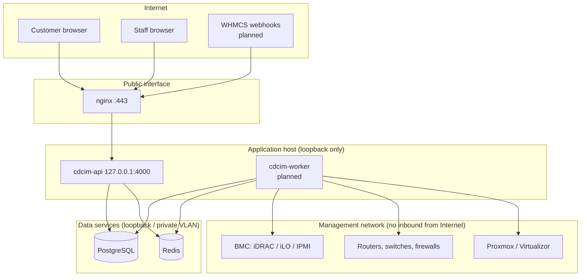

# Security model and boundaries

This document describes what Phase 1 enforces today. Items marked _(planned)_ are designed but not built yet.

## Trust boundaries

- Only nginx listens on a public interface. The API binds to `127.0.0.1` by default (`HOST`).
- Only the worker (Phase 4+) talks to the management network. The API never opens connections to devices on behalf of a request; it enqueues jobs. This keeps device credentials and management-network reachability out of the internet-facing process.
- PostgreSQL and Redis bind to loopback or a private VLAN, and Redis requires a password in production.

## Authentication

| Control | Implementation |
|---|---|
| Password storage | Argon2id, 19 MiB memory, t=2, p=1 (OWASP). Parameters are upgraded transparently at next login. |
| Password policy | Minimum 12 characters, plus a ban on common passwords, single repeated characters and passwords containing the user's email. |
| Enumeration resistance | Unknown email and wrong password return the same message, and a dummy hash keeps timing equal. |
| Lockout | After 5 consecutive failures, exponential lock (15 min doubling, max 24 h). Increments are atomic. |
| Rate limit | Per-IP throttle on login and MFA routes (`LOGIN_RATE_LIMIT_PER_MINUTE`), plus a general per-IP budget. |
| MFA | RFC 6238 TOTP. The secret is encrypted at rest, codes cannot be replayed (last time step stored and updated conditionally), there are 10 single-use recovery codes, and each challenge allows 5 attempts with a 5-minute TTL. |
| MFA policy | Organization setting `requireMfaForStaff`. Staff without MFA are restricted to enrollment routes. |
| Sessions | 256-bit random token in an HttpOnly, SameSite=Lax, Secure (prod) cookie. Only its SHA-256 hash is stored. Idle and absolute timeouts are set per organization. |
| Session revocation | On logout, password change (other sessions), MFA enable or reset, user disable, customer closure, or admin "sign out everywhere". |
| CSRF | Synchronizer token bound to the session. The readable `cdcim_csrf` cookie must be echoed in `X-CSRF-Token` on every unsafe method, and the server compares hashes in constant time. |

## Authorization

- Permissions are `resource.action` strings from a single catalog ([`permissions.ts`](../packages/shared/src/permissions.ts)).
- `*.read` never implies a write. Control operations (`hardware.control`, `network.config`, `provisioning.execute`) are separate permissions, so a read-only NOC role can never power-cycle a server or push a configuration.
- Permissions flagged **staff-only** cannot be placed in customer roles (rejected on save) and are dropped at request time for customer users even if a role were misconfigured. Unknown permission strings grant nothing.
- **No privilege escalation:** you can only assign roles, edit roles or manage users whose permissions you already hold.
- The organization always keeps at least one active Super Administrator. Users cannot disable themselves or change their own roles.
- Every denial is audited with the missing permissions.

## Tenant isolation

- Every domain row carries `org_id`. Customer-owned rows carry `customer_id`.
- Services build their `WHERE` clause with `tenantFilter(principal, cols)`. For customer principals this adds `customer_id = principal.customerId`, so company-owned infrastructure (`customer_id IS NULL`) is invisible to customers by construction.
- An out-of-scope id returns **404**, the same as a missing one, so another tenant's resources cannot be discovered.
- Staff-only fields (internal notes, billing references) are stripped in the service view layer for customer principals.
- Administration routes (`users`, `roles`, `settings`, `audit`, `overview`) are marked `@StaffOnly()`.
- Database `CHECK` constraint: a user is a customer user if and only if `customer_id` is set.

## Secrets at rest

`SecretBox` (AES-256-GCM) encrypts MFA seeds today, and will encrypt SNMP communities and v3 keys, BMC passwords and integration tokens from Phase 3 on.

- Key ring in `CDCIM_ENCRYPTION_KEYS` (`id:base64key,...`). The first key encrypts and all keys decrypt, so a key can be rotated without downtime. `needsRotation()` finds values to re-encrypt.
- Additional authenticated data binds each ciphertext to its row and column, so a ciphertext copied elsewhere fails to decrypt.
- Secrets are **write-only** through the API _(planned for device credentials)_: responses show `configured: true`, never the value.
- Logs redact cookies, authorization headers, CSRF tokens and any field named like a password, secret, token, community or key. Audit metadata is sanitized with the same rule before hashing.

## Audit log

- Append-only table. `UPDATE`, `DELETE` and `TRUNCATE` are blocked by database triggers.
- Each row stores `hash = SHA-256(canonical row + previous hash)` per organization. `GET /api/v1/audit/verify` recomputes the chain and reports the first broken record. This detects tampering even by someone who can disable the trigger (tested).
- Appends are serialized by a per-organization advisory lock (tested under 15 concurrent writes).
- Changes and their audit rows commit in one transaction, so a change cannot succeed without its record.

## Transport and headers

- TLS terminates at nginx (Let's Encrypt or your own certificate). HSTS is enabled in production.
- Helmet applies CSP, `X-Content-Type-Options`, frame denial and other headers. `X-Powered-By` is removed.
- Request bodies are limited to 1 MB.

## Known limitations (Phase 1)

- API keys for machine clients are not implemented yet (Phase 8). Today, only interactive sessions authenticate.
- Rate limiting is per API process (in memory). With multiple API processes, move the throttler storage to Redis (planned with Phase 4's worker split).
- `@nestjs/swagger` 11 pulls in a `js-yaml` version with a moderate CPU-exhaustion advisory. It is reachable only through the Swagger UI, which is **disabled in production by default** (`ENABLE_SWAGGER`). The fix requires `@nestjs/swagger` 12 (breaking change) and is scheduled for the next dependency update.
- Backup encryption, credential rotation tooling and management-network isolation checks are Phase 9 items.
