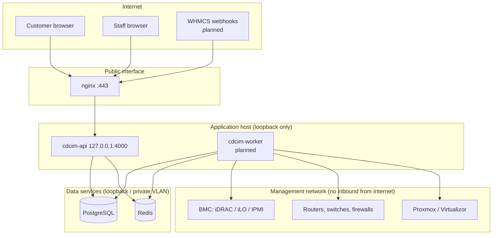

# Security model and boundaries

This document describes what Phase 1 enforces today. Items marked _(planned)_ are designed but not built yet.

## Trust boundaries

- Only nginx listens on a public interface. The API binds to `127.0.0.1` by default (`HOST`).
- Only the worker (Phase 4+) talks to the management network. The API never opens connections to devices on behalf of a request; it enqueues jobs. This keeps device credentials and management-network reachability out of the internet-facing process.
- PostgreSQL and Redis bind to loopback or a private VLAN, and Redis requires a password in production.

## Authentication

| Control | Implementation |
|---|---|
| Password storage | Argon2id, 19 MiB memory, t=2, p=1 (OWASP). Parameters are upgraded transparently at next login. |
| Password policy | Minimum 12 characters, plus a ban on common passwords, single repeated characters and passwords containing the user's email. |
| Enumeration resistance | Unknown email and wrong password return the same message, and a dummy hash keeps timing equal. |
| Lockout | After 5 consecutive failures, exponential lock (15 min doubling, max 24 h). The outcome is decided under a row lock (`SELECT … FOR UPDATE`), so parallel guesses cannot exceed the threshold and a correct password is refused while locked. Failed MFA codes and failed in-session re-authentication count toward the same limit. |
| Rate limit | Per-IP throttle on login and MFA routes (`LOGIN_RATE_LIMIT_PER_MINUTE`), plus a general per-IP budget. |
| MFA | RFC 6238 TOTP. The secret is encrypted at rest, codes cannot be replayed (last time step stored and updated conditionally), there are 10 single-use recovery codes, and each challenge allows 5 attempts with a 5-minute TTL. |
| Re-authentication | Changing the password or turning off MFA requires the current password. Failures are audited, throttled per IP and count toward lockout. Reaching the lock this way also ends all of the user's sessions, so a stolen session cookie can't be used to guess the password. |
| MFA policy | Organization setting `requireMfaForStaff`. Staff without MFA are restricted to enrollment routes. |
| Sessions | 256-bit random token in an HttpOnly, SameSite=Lax, Secure (prod) cookie. Only its SHA-256 hash is stored. Idle and absolute timeouts are set per organization. |
| Session revocation | On logout, password change (other sessions), MFA enable or reset, user disable, customer closure, or admin "sign out everywhere". |
| CSRF | Synchronizer token bound to the session. The readable `cdcim_csrf` cookie must be echoed in `X-CSRF-Token` on every unsafe method, and the server compares hashes in constant time. |

## Authorization

- Permissions are `resource.action` strings from a single catalog ([`permissions.ts`](../packages/shared/src/permissions.ts)).
- `*.read` never implies a write. Control operations (`hardware.control`, `network.config`, `provisioning.execute`) are separate permissions, so a read-only NOC role can never power-cycle a server or push a configuration.
- Permissions flagged **staff-only** cannot be placed in customer roles (rejected on save) and are dropped at request time for customer users even if a role were misconfigured. Unknown permission strings grant nothing.
- **No privilege escalation:** you can only assign roles, edit roles, or change anything about another user (roles, status, name) when you already hold every permission involved.
- The organization always keeps at least one active Super Administrator. User changes are serialized per organization with an advisory lock, so two admins disabling each other at once cannot leave none. Users cannot disable themselves or change their own roles.
- Every denial is audited with the missing permissions.

## Tenant isolation

- Every domain row carries `org_id`. Customer-owned rows carry `customer_id`.
- Services build their `WHERE` clause with `tenantFilter(principal, cols)`. For customer principals this adds `customer_id = principal.customerId`, so company-owned infrastructure (`customer_id IS NULL`) is invisible to customers by construction.
- An out-of-scope id returns **404**, the same as a missing one, so another tenant's resources cannot be discovered.
- Staff-only fields (internal notes, billing references) are stripped in the service view layer for customer principals.
- Administration routes (`users`, `roles`, `settings`, `audit`, `overview`) are marked `@StaffOnly()`.
- Database `CHECK` constraint: a user is a customer user if and only if `customer_id` is set.

## Secrets at rest

`SecretBox` (AES-256-GCM) encrypts MFA seeds today, and will encrypt SNMP communities and v3 keys, BMC passwords and integration tokens from Phase 3 on.

- Key ring in `CDCIM_ENCRYPTION_KEYS` (`id:base64key,...`). The first key encrypts and all keys decrypt, so a key can be rotated without downtime. `needsRotation()` finds values to re-encrypt.
- Additional authenticated data binds each ciphertext to its row and column, so a ciphertext copied elsewhere fails to decrypt.
- Secrets are **write-only** through the API _(planned for device credentials)_: responses show `configured: true`, never the value.
- Logs redact cookies, authorization headers, CSRF tokens and any field named like a password, secret, token, community or key. Audit metadata is sanitized with the same rule before hashing.

## Audit log

- Append-only table. `UPDATE`, `DELETE` and `TRUNCATE` are blocked by database triggers.
- Each row stores `hash = SHA-256(canonical row + previous hash)` per organization. `GET /api/v1/audit/verify` recomputes the chain and reports the first broken record. This detects tampering even by someone who can disable the trigger (tested).
- Appends are serialized by a per-organization advisory lock (tested under 15 concurrent writes).
- Changes and their audit rows commit in one transaction, so a change cannot succeed without its record.

## Transport and headers

- TLS terminates at nginx (Let's Encrypt or your own certificate). HSTS is enabled in production.
- Helmet applies CSP, `X-Content-Type-Options`, frame denial and other headers. `X-Powered-By` is removed.
- Request bodies are limited to 1 MB.

## Independent review

At the end of Phase 1, a separate reviewer audited this code. It found six defects, all fixed with regression tests in `apps/api/test/security-regressions.e2e.test.ts`: concurrent lockout bypass, a race between two super admins, unlimited MFA guessing across fresh challenges, a lower-privileged admin able to re-enable a super admin, unthrottled and unaudited in-session password checks, and a self-session revocation audited outside its transaction. The public readiness endpoint no longer returns raw dependency errors.

## Phase 2 review

A separate reviewer audited the physical-DCIM code and found nine defects, all fixed with regression tests in `apps/api/test/dcim-regressions.e2e.test.ts`:
- A customer change on a racked device, or a rack edit, could bypass a rack's dedication to a customer.
- Concurrent rack shrink and placement could both commit. The fit trigger now locks the rack row.
- A placement and a conflicting reservation could race. The rack row is now locked for both.
- A 0U device could reach a racked state without a rack.
- A model change on a racked 0U device left a sized device without a unit. A new DB check now prevents this.
- CSV import returned raw SQL in error messages and skipped range and date validation.
- Bulk and import audit records lacked the customer and before/after values.
- Customers could search by the staff-only management address.

## Phase 3: device credentials and discovery

- **Write-only secrets.** SNMP communities and v3 keys, RouterOS and NX-API passwords and FortiOS tokens are encrypted with the platform key ring (AES-256-GCM). No API returns them; the UI shows only "secret set" with a date. Audit records name the credential kind, host and user, never the secret.
- **Bound to a destination.** The ciphertext's additional authenticated data covers organization, device, kind, host and port. Copying a ciphertext to another device, or changing the stored host without re-entering the secret, makes it undecryptable. The host is fixed when the secret is saved, so a later edit to the device's management address (by someone with only `dcim.write`) cannot redirect a secret.
- **Only the worker decrypts.** `cdcim-worker` is a separate process. Jobs on the queue carry only a run id. Decrypted values live in one function scope, are redacted from any error text and are never logged (`authKey`, `privKey`, `community`, `password`, `token`, `secretEnc` are on the logger's redact list).
- **Read-only collection.** Adapters issue SNMP GET/GETBULK, HTTP GET, or NX-API `cli_show` with a fixed list of `show` commands. There is no code path that writes to a device. Applying a discovery changes only the DCIM database, never deletes documented ports, and is recorded in the audit log.
- **Permissions.** Configuring credentials needs `monitoring.configure` (a dangerous, staff-only permission). Starting a discovery and applying it needs `network.write`. Network infrastructure is staff-only; customers see only their own IP subnets and addresses, without infrastructure device names or staff subnets.
- **TLS.** Certificate verification is on by default for HTTPS adapters. Turning it off is a per-credential choice for self-signed management certificates. Plain HTTP is offered for labs and labelled as sending credentials in clear.
- **Reach of the worker.** Whoever holds `monitoring.configure` can point a credential at any host and port the worker can reach. Run the worker on a host whose network access is limited to the management network (Phase 9 adds a configurable allow-list).
- **Timeouts.** Every SNMP request and HTTP call has a timeout (HTTP is a hard deadline for the whole request); each run has a 120-second ceiling; runs stuck for 15 minutes are marked failed so a device is never blocked.

## Phase 3 review

A separate reviewer audited the network, IPAM and discovery code. Confirmed defects, all fixed with regression tests in `apps/api/test/network-regressions.e2e.test.ts`:
- A credential with no host followed the device's management address at run time, so a `dcim.write` user could redirect secrets. The host is now saved with the secret and bound into its encryption context.
- LLDP neighbors were matched to our devices by the first label of their name, which could link another network's `core1.isp.net` to our `core1`. Matching now needs the exact name, or a bare name equal to our device's short name; address matches use the global table only.
- Applying a run whose neighbor collection failed deleted all existing observations. Deletion is now limited to protocols the run reported.
- A customer saw usage counts that included another customer's addresses in a nested prefix. Counts are per customer, and prefixes can no longer nest across customers.
- `PATCH /ipam/addresses/:id` cleared fields that were not sent.
- An invalid circuit status filter returned 500; a zero port speed returned 409.

Plausible items also addressed: concurrent applies are serialized per device; the worker no longer overwrites a run the API marked stale; discovery can't make a logical interface a LAG member; customer address views hide infrastructure device names and staff subnets; the 1 MB JSON limit applies everywhere except the two CSV import routes.

## Dependency advisories

`npm audit --omit=dev` reports only the `js-yaml` advisory below (Swagger UI, disabled in production). The remaining advisories are in development and test tooling (`vitest` 2, `esbuild`, `tinypool`, `drizzle-kit`'s bundled `esbuild`) that never runs in production installs; they are scheduled for the next tooling upgrade.

## Known limitations (Phase 1)

- The audit hash chain detects edits and deletions in the middle of the log, but not removal of the newest records, because the verifier has no external anchor. Phase 9 adds periodic export of the chain head (to object storage or email) as that anchor.

- API keys for machine clients are not implemented yet (Phase 8). Today, only interactive sessions authenticate.
- Rate limiting is per API process (in memory). With multiple API processes, move the throttler storage to Redis (planned with Phase 4's worker split).
- `@nestjs/swagger` 11 pulls in a `js-yaml` version with a moderate CPU-exhaustion advisory. It is reachable only through the Swagger UI, which is **disabled in production by default** (`ENABLE_SWAGGER`). The fix requires `@nestjs/swagger` 12 (breaking change) and is scheduled for the next dependency update.
- Backup encryption, credential rotation tooling and management-network isolation checks are Phase 9 items.
